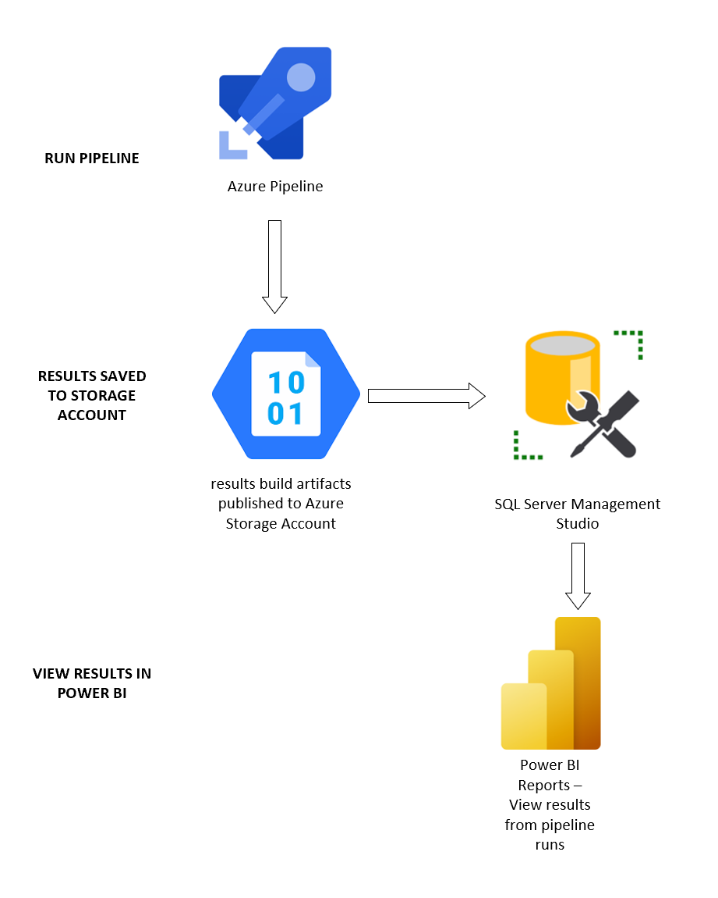

This document explains the processes taking place when publishing test results to Power Bi.

Storage Technologies Used:
When running the pipeline to execute the JMeter test rig, a results artifact gets published. The results of the pipeline run get stored in a file results.jtl. You can view these results and compare results from various runs in Power BI. 
Various storage technologies publish results to Power BI. The order is listed below:  
1.	Contents of results build artifacts are stored in an Azure Blob Storage Account
2.	Results loaded into a database in SQL Server Management Studio
3.	Data retrieved from SQL server and displayed in Power BI
 
The Azure Blob Storage was used because it allows you to storage large amounts of unstructured data stored in any file and any size. In addition, this storage account allows access to application data from anywhere, allowing for it to be retrieved from SQL Server and displayed in Power BI. 

Diagram from running the pipeline to publishing results:

How to use ACR
Running the pipeline incorporates an implementation of a Kubernetes JMeter cluster. This allows for the execution of a JMeter test script on arbitrarily sized JMeter test rig and then will generate:
•	A deployed AKS cluster using managed identities. The AKS cluster is intended to remain running to provide reporting across performance test runs.
o	The initial size of the cluster is a single node with 2 cores. To successfully run a test with the smallest test rig requires 3 nodes.
o	To increase or decrease the number of nodes you will need to use the az aks scale command to a minimum of 3 nodes assuming you did not override the nodeVMSize when you run the CreateTestRig PowerShell command.
o	When the test rig is not actively being used to execute tests you can scale it back down to a single node using the az aks scale command.
•	A JMeter DashBoard Report
•	JMeter Test Log (JTL)

When running the pipeline, you can select the option to auto-scale the cluster to 3 nodes or you can specify how many nodes you want to scale to. 
