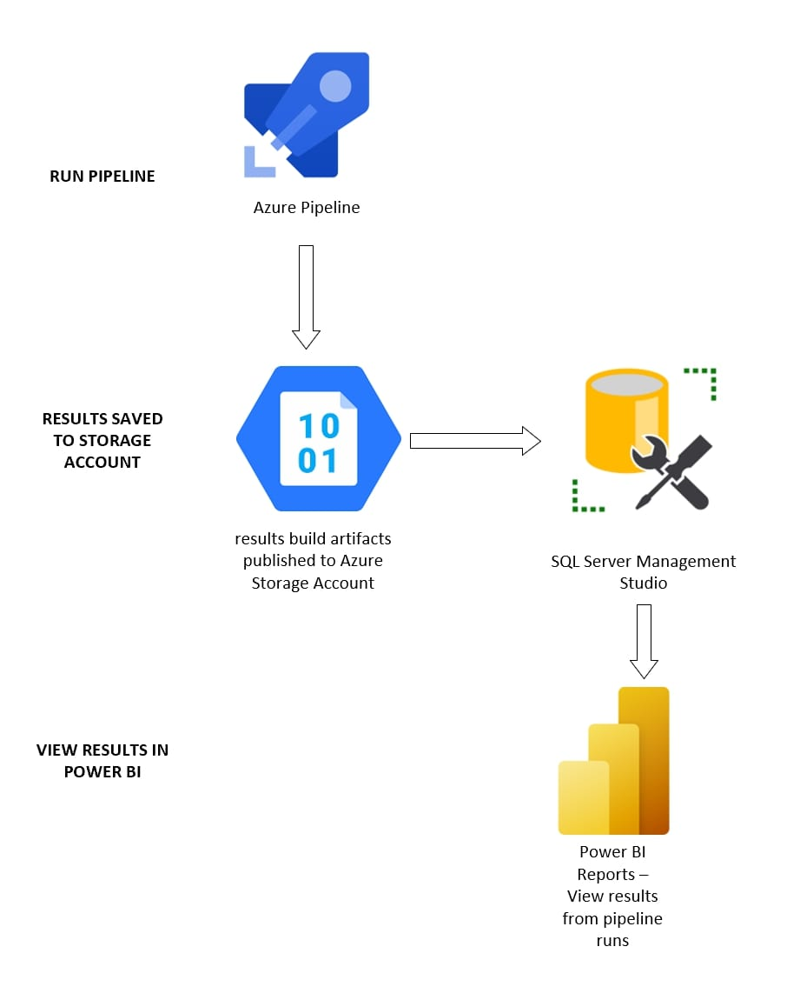

# Storage Technologies Used to Publish Results to Power BI
This document explains the processes taking place when publishing test results to Power Bi.

## Storage Technologies Used
When running the pipeline to execute the JMeter test rig, a results artifact gets published. The results of the pipeline run get stored in a file results.jtl. You can view these results and compare results from various runs in Power BI. 
Various storage technologies publish results to Power BI. The order is listed below:  
1.	Contents of results build artifacts are stored in an Azure Blob Storage Account
2.	Results loaded into a database in SQL Server Management Studio
3.	Data retrieved from SQL server and displayed in Power BI
 
The Azure Blob Storage was used because it allows you to storage large amounts of unstructured data stored in any file and any size. In addition, this storage account allows access to application data from anywhere, allowing for it to be retrieved from SQL Server and displayed in Power BI. 

## Publishing Previous Results to Azure Storage Account
**File Name:** PublishPreviousResults.ps1
- -tenant (required): K8S NameSpace
- -TestName (required): full or relative path to the JMeter test script
- -PublishPreviousResultsToStorageAccount (required): full or relative path to JMeter results file
- -PublishTestToStorageAccount (required): full or relative path to JMeter test file
- -StorageAccount (required)
  - The string name for the storage account you are uploading 
- -Container (required)
  - Blob Storage container that you are uploading the results to.
- -StorageAccountPathTopLevel (optional)
  - If you override your default test name the new name will become the root folder in the target container blob in the Azure Storage Account
- -SqlServerPresent (optional)
  - This boolean flag confirms that the user has a SQL Server Database set up to proceed with publishing results to Power BI 
- -AzureContainerInstance 
  - The string name of the Azure Container Instance
- -ResourceGroup 
  - The string name of the resource group which the Azure Container Instance resides in 

## Viewing results in Power BI
**Report: jmeter report.pbit** in the docker directory

Viewing your test run results in PowerBI provides you with a more advanced reporting dashboard. The data in PowerBI is being retrieved from your SQL Server Database. There may be a few setting configurations you will have to do in order to view your data.

**Configure your Data source settings**

1. File > Options and settings
2. Click **Data Source Settings**
3. Change Source
    +  If you see your database server name then make the correct selection and close the window
    + If you don't see your database server name :
        + Click Change Source
        + Enter your Server name and Database name
        + Click Ok
    + Close Window
4. Click **Apply Changes** at the top of the report

Your report will update with the results stored in your Azure Storage Account. 

## Diagram: Running the pipeline to publishing results

## How to use ACR
Running the pipeline incorporates an implementation of a Kubernetes JMeter cluster. This allows for the execution of a JMeter test script on arbitrarily sized JMeter test rig and then will generate:
- A deployed AKS cluster using managed identities.  The AKS cluster is intended to remain running to provide reporting across performance test runs.
  - The initial size of the cluster is a [single node](https://docs.microsoft.com/en-us/azure/aks/concepts-clusters-workloads#nodes-and-node-pools) with 2 cores.  To successfully run a test with the smallest test rig requires 3 nodes.
  - To increase or decrease the number of nodes you will need to use the [az aks scale](https://docs.microsoft.com/en-us/cli/azure/aks?view=azure-cli-latest#az_aks_scale) command to a minimum of 3 nodes *assuming* you did not override the nodeVMSize when you run the CreateTestRig PowerShell command.
  - When the test rig is not actively being used to execute tests you can scale it back down to a single node using the [az aks scale](https://docs.microsoft.com/en-us/cli/azure/aks?view=azure-cli-latest#az_aks_scale) command.
- A [JMeter DashBoard Report](http://jmeter.apache.org/usermanual/generating-dashboard.html#generation)
- [JMeter Test Log \(JTL\)](https://jmeter.apache.org/usermanual/get-started.html#non_gui)

When running the pipeline, you can select the option to auto-scale the cluster to 3 nodes or you can specify how many nodes you want to scale to. 
