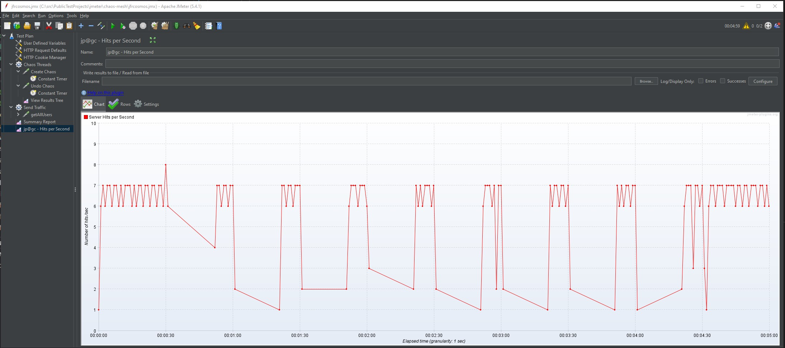

# Chaos-Mesh triggered by JMeter

Just doing performance testing is like writing new code in COBOL.  Yes you could do it but **WHY**?  The cloud is all about redundancy, resiliency and scaling out to take on those millions of users to hopefully make them happy users!  If your application/infrastructure/giganto-super-complex-smart-thing is doing more than just serving up a single html web page then you **MUST** include fault injection as a *standard* part of any and all performance testing.

This is why I am completely **smitten** with [Chaos Mesh](https://chaos-mesh.org/) for everything I want to:

- Systematically break the same way over and over again.
- Systematically slow down, consume memory and generally create **CHAOS**
- For micro services hosted in Azure Kubernetes Services

# It really is that EASY

The picture below shows an application at a steady RPS, then chaos is introduced 30 seconds in and then chaos is turned off after 4 minutes.

## How you ask?

- Take a look at the Chaos Threads in the [jfrcosmos](./jfrcosmos.jmx) jmeter test
- It does a kubectl apply -f [block-external-network.yaml](./block-external-network.yaml)
- Waits for a while and then does a kubectl delete -f [block-external-network.yaml](./block-external-network.yaml)

**The magic comes from deploying chaos-mesh to your Kubernetes cluster**
