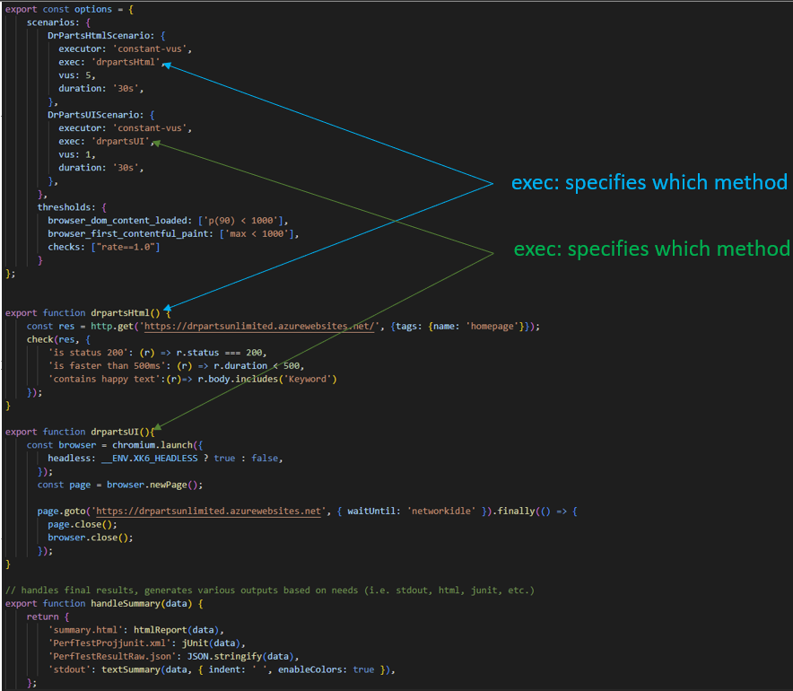

# K6 Samples
This is dedicated to creating samples that I had to hunt for in the K6 documentation.  

# Multiple Threads in K6

You know life would have been much easier if K6 had just added the keyword 'threads' to their [advanced scenarios documentation](https://k6.io/docs/using-k6/scenarios/advanced-examples/).  K6 is written in Golang which uses Golang specific 'threads' called [Goroutine](https://go.dev/tour/concurrency/1).  There's a great comparison documented at: https://www.geeksforgeeks.org/golang-goroutine-vs-thread/

## K6 Scenarios

### Multiple Indepenent Threads K6

Every scenario inside the scenarios section can specify an exec option which indicates which exported function you want that scenario to run.  It should be noted that you can have multiple scenarios pointed to the same routine if you wish.

### K6 Executors

There are a number of [K6 Executors](https://k6.io/docs/using-k6/scenarios/executors/) available which effect how the threads behave. 

- I normally use the [constant-vus](https://k6.io/docs/using-k6/scenarios/executors/constant-vus) or the [ramping-vus](https://k6.io/docs/using-k6/scenarios/executors/ramping-vus)
- Each K6 Executor will have different variables and required entries so be careful when copy-pasting scenarios.
- You can set the same environment variable to different values for each scenario.  
  - You may have a single exported function to run load but you want it to behave differently based on a common environment variable

## Samples

|File|Notes|
|---|---|
|[drpartsunlimitedk6.js](./drpartsunlimitedk6.js)|Main referenced sample for the DRPartsUnlimited site|
